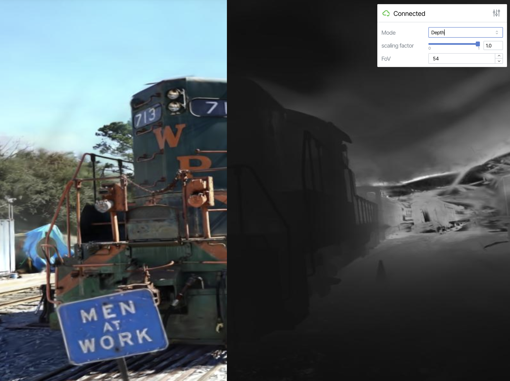

# Web-3DGS


`Web-3DGS` is an interactive visualzation tool for 3d gaussian splatting based on the awesome library `Viser`. It would freely move anywhere by `W`,`A`,`S`,`D` or mouse movements, and it could be enabled to render RGB and Depth.


This repository is <b>working on progress</b> to add more useful features. 

## Dependency
```
torch
viser
gsplat
ninja
```

## How to use
```
python main.py -s {.ply_path_from_3dgs} 
```
